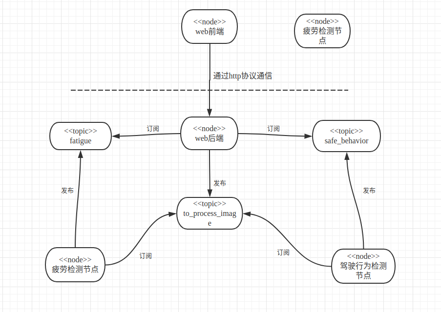
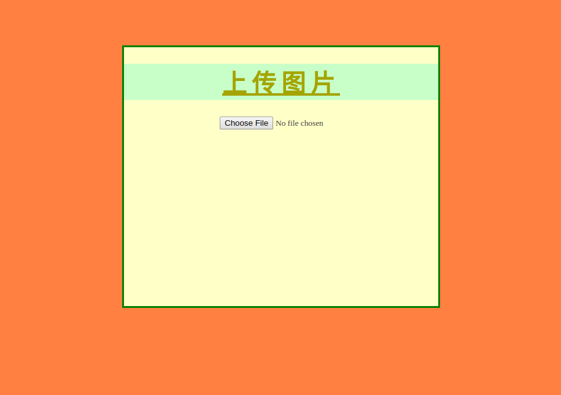

# 项目简介  
这个项目主要由两部分组成，司机的疲劳检测和行为检测。  

疲劳检测：　　
* 基于眼睛的疲劳检测
* 基于打哈欠的疲劳检测　　

行为检测：　　  
* 安全驾驶
* 右手打字
* 右手打电话
* 左手打字
* 左手打电话
* 调收音机
* 喝饮料
* 拿后面的东西
* 整理头发和化妆
* 和其他乘客说话  
# 项目结构图  
  
# 项目的目录结构  
```
catkin_ws
├── build
├── devel
│   ├── env.sh
│   ├── include
│   ├── lib
│   ├── setup.bash
│   ├── setup.sh
│   ├── _setup_util.py
│   ├── setup.zsh
│   └── share
├── install
└── src
    ├── Fatigue-Detection
    │   ├── distracted_driver_detection
    │   │   ├── config.py
    │   │   ├── detect.py
    │   │   ├── __init__.py
    │   │   ├── models
    │   │   │   ├── callbacks.py
    │   │   │   ├── inception_v3.py
    │   │   │   ├── __init__.py
    │   │   ├── splitter.sh
    │   │   └── train.py
    │   ├── fat_detect.py
    │   ├── fatigue_detection
    │   │   ├── detection.py
    │   │   ├── ImgWindow.py
    │   │   ├── __init__.py
    │   ├── fatigue_server.py
    │   ├── robo_talker.py
    │   ├── safe_behavior_server.py
    │   ├── static
    │   │   ├── jquery.js
    │   │   └── upload.css
    │   ├── templates
    │   │   └── upload.html
    │   └── web_cam.py
    └── venv

```
# 项目的配置
需要预先安装好ros kinetic和python3.5  
ros下载安装：http://www.ros.org/
```sh
pip install -r requirements.txt
```  
# 项目运行
这里我构建了一个python的虚拟环境
启动五个shell,分别输入以下内容　　
```sh
roscore
```
```sh
. ../../devel/setup.bash
. ../venv/bin/activate
python web_cam.py
```
```sh
. ../../devel/setup.bash
. ../venv/bin/activate
python safe_behavior_server.py
```
```sh
. ../../devel/setup.bash
. ../venv/bin/activate
python fatigue_server.py
```
```sh
. ../../devel/setup.bash
. ../venv/bin/activate
python fat_detect.py
```  
# 结果
在浏览器里输入http://127.0.0.1:7779/　　


# 数据集下载
训练模型所用的数据集：https://www.kaggle.com/c/state-farm-distracted-driver-detection/leaderboard

# inception v3模型训练
* 创建data文件夹，把训练集和测试集放到data文件夹下
* 划分数据，把训练集的一部分拿出来当验证集
* 训练模型

```sh
cd distracted_driver_detection
sudo ./splitter.sh
cd ..
mkdir models
python train_model.py  --lr 1e-5 --batch 32--epochs 5
```
